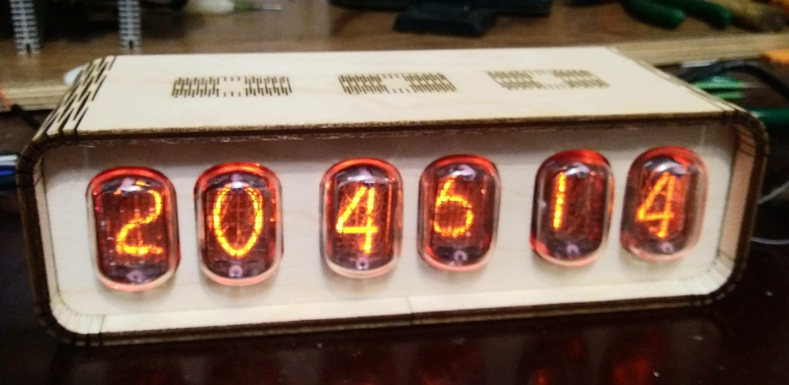
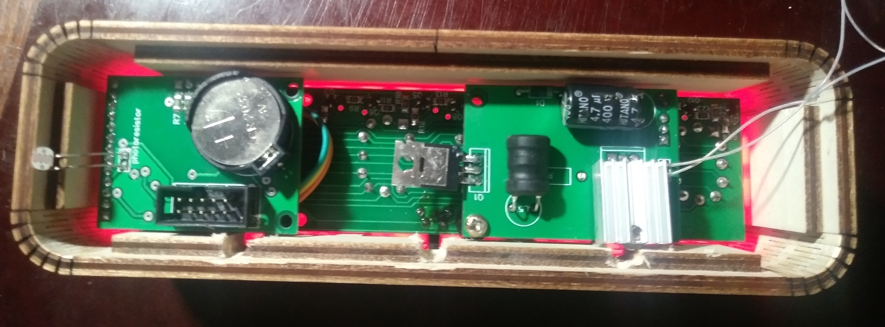

# Nixie lamp-clock

## Nixie Clock
The clock has six valum tubes to display hours, minutes and seconds. Three buttons used to open menu and change time and date settings, backlight color and animation, change digit animation, enable recovery mode for tube. For power supply there is usb conneciton (5V 300mA). Also clock has battery for real time clock, and time and date will not reset after turn off power supply.

## Clock Features:
- Time Display
- Date Display
- Brightness auto control (low at night and high at day)
- Three buttons for settings
- usb power supply

## Settings:
Click middle button to open settings. Six numbers are responsible for six menu items:
1. Time and Date settings
(hour->min->date->month->year)
2. Backlight animation:
	(0 - turn off backlight
		1-4 - four backlight animation)
3. Constant color backlight
	(press or hold left/right button to change color)
4. Digit animation (0-no animation, 1-smooth digit switching)
5. Vacuum tube recovery mode (0-turn off, 1-turn on)
6. Exit

After 10 sec will be auto exit if any button not pressed.

## Hardware
### DC-DC Power Supply
- SLG46110V - generator for pulse transformer
- Pulse Transformer - convert 5V to 140V for vacuum tube
### Scheme Components
- Atmega8
- DS3231 - real time clock
- K155ID1 (analog NTE74141)	- BCD−to−Decimal Decoder
- 6x IN12 - vacuum tubes
- 6x WS2812 - led for backlight

<!-- [PCB video](https://www.instagram.com/p/Bldvv9dl7gn/?utm_source=ig_share_sheet&igshid=g3wekemrw5ij) -->
 
 
 