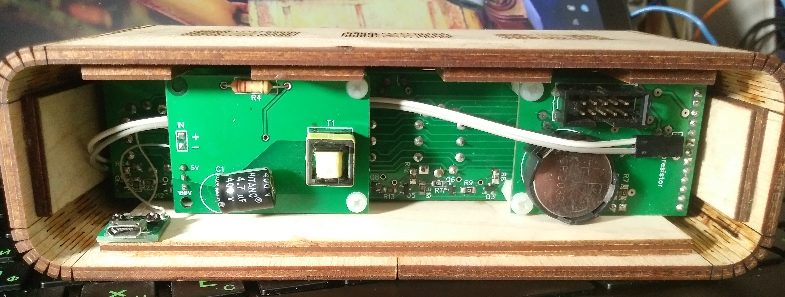

# Nixie lamp-clock

## Ламповий годинник

Годинник на 6 лампах ИН-12. Годинник реального часу  - DS3231. Підсвітка на 6 світлодіодах WS2812.
Індикація динамічна. Реалізовано 3 режими автоматичної зміни кольору підсвітки, можливіть вибору плавного перемикання цифр. 

### Основні ф-ції:
- відображення часу
- відображення дати
- авто регулювання яскравості підсвітки (вночі яскравість зменшується, вдень - встановлюється на максимальне значення)
- три кнопки для настройки

### Управління годинником:
 Натисканням на кнопку посередині відбувається перехід у меню годинника. На дисплеї відобразиться 6 цифр (1..6), які відповідають за пункти меню:
1. настройка години та дати
	(спочатку іде настройка годин, хвилин, далі число, місяць та рік.
2. вибір ефекту автоматичної зміни кольору підсвітки:
	(	0 - вимкніти підсвітку
		1-4 - автоматична зміна кольору підсвітки, різні ефекти)
3. вибрі статичного кольору підсвітки 
	(кнопками вправо вліво можна вибрати колір підсвітки)
4. вибрі плавного перемикання цифр
5. зарезервовано (при натисканні перемикається на 1 пункт меню)
6. вихід із меню

### Додаткові ф-ції
 - авто вихід із настройок через 10 секунд після останнього натискання любої кнопки

[PCB video](https://www.instagram.com/p/Bldvv9dl7gn/?utm_source=ig_share_sheet&igshid=g3wekemrw5ij)
 
 
 